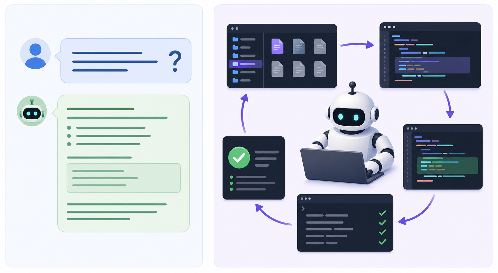

# 003. 챗봇과 에이전트의 차이

난이도: 초급  
기준일: 2026년 05월 03일
저자: AI_Innovation_Studio



## 핵심 개념

챗봇은 대화에 답합니다. 에이전트는 목표를 받고, 상황을 읽고, 계획을 세우고, 도구를 사용하고, 결과를 관찰한 뒤 다시 행동합니다. 이 차이를 이해하면 Claude Code가 왜 단순한 코드 생성기보다 강력한지 알 수 있습니다.

예를 들어 챗봇에게 “테스트를 고쳐줘”라고 하면 테스트가 실패하는 일반적인 이유와 수정 예시를 설명할 수 있습니다. 하지만 에이전트형 도구는 실제 테스트를 실행하고, 실패 로그를 읽고, 관련 파일을 찾아 수정하고, 다시 테스트를 실행할 수 있습니다.

## 에이전트의 기본 루프

에이전트는 보통 다음 루프를 반복합니다.

1. 목표를 이해한다.
2. 필요한 정보를 찾는다.
3. 계획을 세운다.
4. 도구를 사용한다.
5. 결과를 관찰한다.
6. 실패하면 수정한다.
7. 완료 기준을 확인한다.

Claude Code의 강점은 이 루프가 개발자의 실제 작업 방식과 닮아 있다는 점입니다. 좋은 개발자는 코드를 추측으로 고치지 않습니다. 파일을 읽고, 원인을 찾고, 작은 수정을 하고, 테스트합니다. Claude Code도 같은 흐름으로 일하게 만들어야 합니다.

## 에이전트에게 필요한 지시

에이전트는 자유도가 높기 때문에 명확한 지시가 필요합니다.

- 목표: 무엇을 달성해야 하는가
- 범위: 어떤 파일이나 모듈을 다룰 수 있는가
- 금지: 어떤 파일이나 행동은 피해야 하는가
- 검증: 완료를 어떻게 확인할 것인가
- 보고: 결과를 어떤 형식으로 알려야 하는가

이 다섯 가지가 없으면 에이전트는 과하게 넓은 작업을 시도하거나, 사용자가 원하지 않는 방식으로 문제를 해결할 수 있습니다.

## 실습

아래 챗봇형 요청을 에이전트형 요청으로 바꿔 보세요.

```text
이 프로젝트 좀 개선해줘.
```

좋은 에이전트형 요청은 다음처럼 시작할 수 있습니다.

```text
이 프로젝트의 구조를 먼저 분석해줘.
아직 파일은 수정하지 말고 다음 항목만 보고해줘.

1. 기술 스택
2. 실행 방법
3. 테스트 방법
4. 가장 먼저 개선할 만한 위험 요소 5개
5. 수정이 필요하다면 우선순위별 계획
```

## Claude 또는 Claude Code에 입력할 프롬프트

```text
너는 지금부터 코드 에이전트처럼 행동해야 한다.
바로 수정하지 말고 다음 순서를 지켜줘.

1. 관련 파일 찾기
2. 현재 동작 설명
3. 문제 가능성 정리
4. 수정 계획 제안
5. 내가 승인하면 수정
6. 테스트 또는 검증 방법 실행

작업 대상:
[여기에 작업 설명 입력]
```

## 체크리스트

- [ ] 챗봇은 답변 중심, 에이전트는 실행 중심임을 이해한다.
- [ ] 에이전트에게 범위와 금지 조건을 줄 수 있다.
- [ ] 계획 없이 바로 수정시키는 위험을 설명할 수 있다.
- [ ] 에이전트 루프를 읽기, 계획, 실행, 검증으로 설명할 수 있다.

## 흔한 실수

- 에이전트에게 너무 넓은 목표를 준다.
- “알아서”라는 표현으로 중요한 결정을 맡긴다.
- 검증 방법 없이 완료를 선언하게 한다.
- 중간 계획을 확인하지 않고 큰 변경을 승인한다.

## 다음 단계

다음 장에서는 Claude 생태계를 전체 지도처럼 보고, 각 구성요소가 어떤 역할을 하는지 정리합니다.
