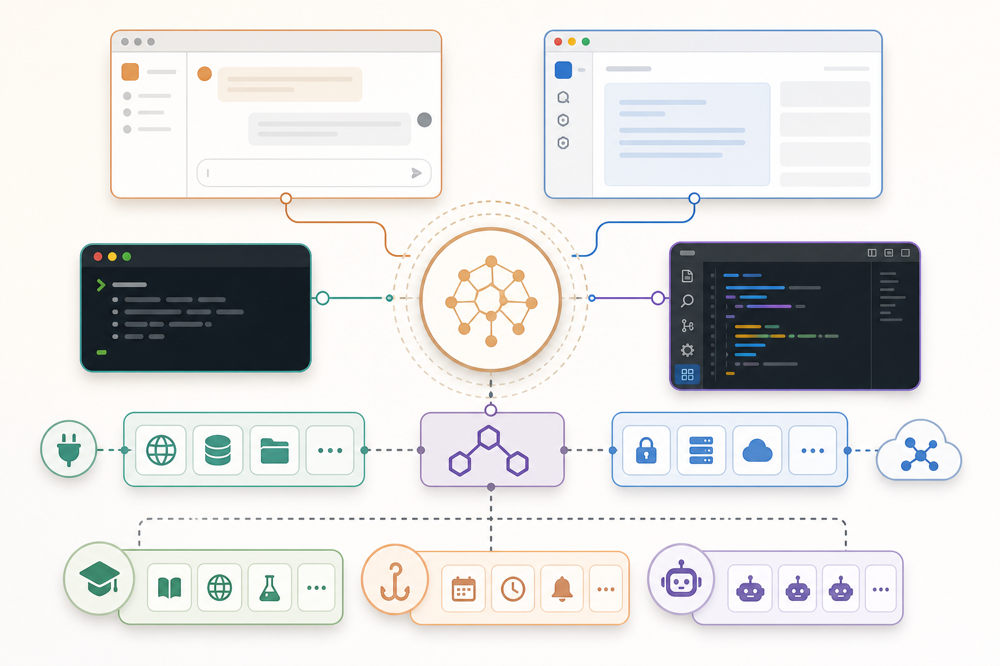

# 004. Claude 생태계 전체 지도

난이도: 초급  
기준일: 2026년 05월 03일



## 핵심 개념

Claude 생태계는 하나의 앱이 아니라 여러 작업 표면과 확장 장치의 조합입니다. 초급자는 Claude Web에서 시작할 수 있고, 개발자는 Claude Code CLI와 IDE 통합을 사용할 수 있으며, 팀은 MCP, Skills, Hooks, Subagents, Agent Teams, CI/CD, Slack, GitHub 연동으로 확장할 수 있습니다.

처음부터 모든 기능을 설치할 필요는 없습니다. 오히려 많은 기능을 한꺼번에 켜면 관리가 어려워집니다. 이 책의 원칙은 단순합니다. 작게 시작하고, 필요가 증명된 기능만 추가합니다.

## 주요 구성요소

### Claude Web

브라우저에서 사용하는 대화형 환경입니다. 글쓰기, 요약, 학습, 기획, 아이디어 정리에 적합합니다. 로컬 프로젝트 파일을 직접 수정하는 작업에는 적합하지 않습니다.

### Claude Desktop

로컬 앱에서 여러 세션, 시각적 검토, 예약 작업 등을 다루는 데 유용합니다. 코드 작업을 터미널과 분리해서 검토하고 싶을 때 도움이 됩니다.

### Claude Code CLI

터미널에서 실행하는 에이전트형 개발 도구입니다. 프로젝트를 읽고, 파일을 수정하고, 테스트와 빌드 명령을 실행하고, Git 작업을 도울 수 있습니다.

### IDE 통합

VS Code, Cursor, JetBrains 계열 IDE에서 Claude Code를 더 편하게 사용할 수 있게 해 줍니다. 선택 영역, diff 검토, 파일 이동, 편집 흐름과 결합됩니다.

### MCP

Model Context Protocol의 약자로, Claude가 GitHub, 데이터베이스, 브라우저, 문서 도구, 사내 API 같은 외부 시스템과 연결될 수 있게 합니다.

### Skills

반복 가능한 작업 절차를 패키징하는 방식입니다. 코드 리뷰, 테스트 작성, 문서화, 배포 점검 같은 작업을 팀 표준으로 만들 수 있습니다.

### Hooks

Claude Code의 특정 이벤트 전후에 명령을 자동 실행합니다. 파일 수정 후 포맷, 커밋 전 테스트, 민감 파일 수정 차단 같은 자동화를 만들 수 있습니다.

### Subagents와 Agent Teams

작업을 전문 역할로 나눠 병렬 처리하는 방식입니다. 코드 리뷰어, 테스트 엔지니어, 문서 작성자, 보안 리뷰어 같은 역할을 나눌 수 있습니다.

## 실습

아래 표를 자신의 상황에 맞게 채워 보세요.

| 작업 | 적합한 도구 | 이유 |
| --- | --- | --- |
| 블로그 글 작성 | Claude Web | 긴 글을 대화로 다듬기 좋음 |
| 버그 수정 | Claude Code CLI | 파일 읽기와 테스트 실행 필요 |
| PR 리뷰 | Claude Code + GitHub MCP | diff와 PR 정보 필요 |
| 팀 규칙 공유 | CLAUDE.md + Skills | 반복 가능한 규칙 필요 |
| 배포 전 검사 | Hooks | 자동 검증 필요 |

## Claude 또는 Claude Code에 입력할 프롬프트

```text
내가 하려는 작업을 Claude 생태계의 어떤 도구로 처리해야 할지 판단해줘.

작업 목록:
- [작업 1]
- [작업 2]
- [작업 3]

다음 기준으로 표를 만들어줘.
1. 추천 도구
2. 이유
3. 필요한 설정
4. 주의할 보안/권한 문제
5. 처음 시작할 최소 구성
```

## 체크리스트

- [ ] Claude Web, Desktop, Code CLI, IDE의 차이를 설명할 수 있다.
- [ ] MCP, Skills, Hooks, Subagents의 역할을 구분할 수 있다.
- [ ] 처음부터 모든 확장 기능을 설치하지 않아야 하는 이유를 이해한다.
- [ ] 내 프로젝트에 필요한 최소 구성을 고를 수 있다.

## 다음 단계

다음 장에서는 이 생태계의 핵심인 Claude Code가 실제로 무엇을 하는 도구인지 배웁니다.
