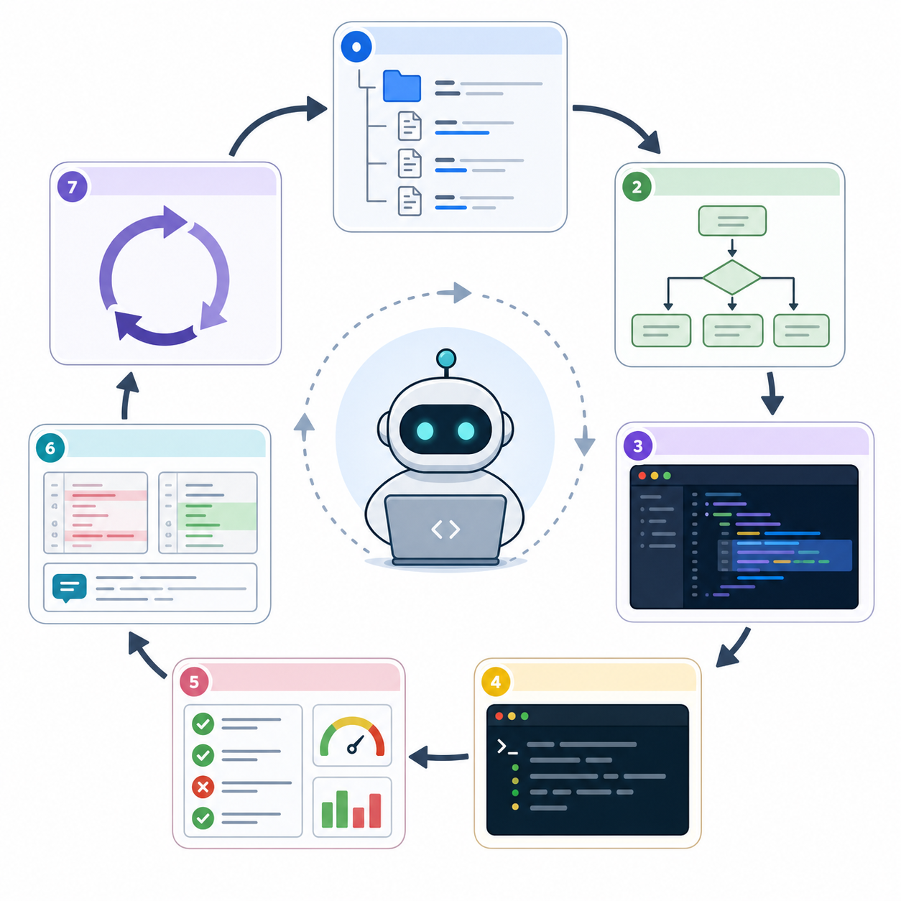

# 005. Claude Code란 무엇인가

난이도: 초급  
기준일: 2026년 05월 03일



## 핵심 개념

Claude Code는 터미널에서 실행되는 에이전트형 코딩 도구입니다. 사용자는 자연어로 요청하고, Claude Code는 프로젝트 파일을 읽고, 변경 계획을 세우고, 파일을 수정하고, 명령을 실행하고, 결과를 검토합니다.

일반적인 코드 생성 도구와 다른 점은 “코드를 제안하는 것”에서 멈추지 않는다는 것입니다. Claude Code는 실제 프로젝트의 구조를 보고, 기존 스타일을 따르고, 테스트를 실행하고, 실패하면 다시 원인을 찾는 방식으로 작업할 수 있습니다.

## Claude Code가 잘하는 일

- 낯선 코드베이스 구조 요약
- 버그 원인 추적
- 다중 파일 리팩터링
- 테스트 작성과 실패 수정
- README와 API 문서 작성
- 린트/포맷 오류 수정
- Git diff 요약
- 커밋 메시지와 PR 본문 작성
- 반복 개발 작업 자동화
- MCP를 통한 외부 도구 연동

## Claude Code가 자동으로 잘하지 못하는 일

Claude Code는 강력하지만 무조건 안전하지는 않습니다. 요구사항이 모호하면 잘못된 방향으로 구현할 수 있습니다. 최신 라이브러리 API를 잘못 추정할 수도 있고, 테스트가 부족하면 오류를 놓칠 수도 있습니다. 그래서 Claude Code를 사용할 때는 항상 다음 흐름을 권장합니다.

1. 먼저 읽게 한다.
2. 바로 수정하지 말고 계획하게 한다.
3. 작은 범위만 수정하게 한다.
4. 테스트 또는 검증을 실행하게 한다.
5. diff를 검토한다.
6. 커밋 전 다시 확인한다.

## 실습

프로젝트 폴더에서 Claude Code를 열었다고 가정하고 첫 요청을 이렇게 작성해 보세요.

```text
이 프로젝트를 처음 보는 개발자라고 생각하고 분석해줘.
아직 파일은 수정하지 마.

다음 항목을 알려줘.
1. 프로젝트 목적
2. 기술 스택
3. 실행 방법
4. 테스트 방법
5. 핵심 폴더와 파일
6. 내가 먼저 읽어야 할 파일 5개
```

이 요청은 안전합니다. 파일을 수정하지 않고 구조만 파악하기 때문입니다. Claude Code 초급자는 이런 읽기 전용 요청부터 시작하는 것이 좋습니다.

## Claude Code에 입력할 프롬프트

```text
이 저장소를 분석해줘.
규칙:
- 아직 파일을 수정하지 마.
- 추측하지 말고 실제 파일을 근거로 설명해.
- 실행 명령은 package 파일, README, 설정 파일을 확인한 뒤 제안해.
- 마지막에 "다음에 내가 할 수 있는 작업 5개"를 난이도순으로 추천해.
```

## 체크리스트

- [ ] Claude Code가 터미널 기반 에이전트라는 점을 이해한다.
- [ ] 읽기 전용 분석 요청을 작성할 수 있다.
- [ ] 수정 전 계획을 요구할 수 있다.
- [ ] 테스트와 diff 검토가 필수임을 이해한다.

## 흔한 실수

- 첫 요청부터 “전체 프로젝트를 개선해줘”라고 한다.
- 실행 명령이나 테스트 방법을 확인하지 않고 수정시킨다.
- Claude Code가 제안한 변경을 Git diff로 확인하지 않는다.
- 실패 로그를 붙여넣지 않고 “안 돼”라고만 말한다.

## 다음 단계

다음 장에서는 Claude를 사용할 수 있는 여러 환경을 비교하고, 어떤 작업에 어떤 환경이 적합한지 정리합니다.
