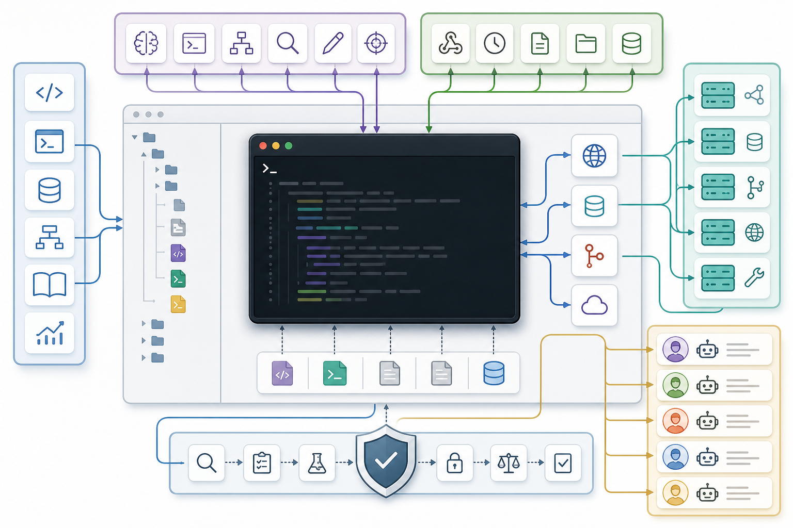

# 066. Skills 개념

난이도: 고급  
기준일: 2026년 05월 03일



## 핵심 개념

Skill은 Claude가 특정 작업을 더 잘 수행하도록 만드는 재사용 가능한 능력 패키지입니다. 하나의 Skill은 필수 `SKILL.md`와 선택적인 scripts, references, templates, assets로 구성됩니다.

공식 문서 기준으로 Skills는 Claude가 요청 맥락을 보고 필요하다고 판단할 때 자동으로 사용할 수 있습니다. slash command처럼 사용자가 직접 `/command`를 입력해야만 실행되는 방식과 다릅니다.

## Skill이 필요한 상황

Skill은 다음 상황에서 유용합니다.

- 같은 체크리스트를 매번 붙여 넣는다.
- 팀의 특정 리뷰 기준이나 배포 절차가 있다.
- 반복되는 파일 처리 작업이 있다.
- 긴 참고 문서를 필요할 때만 읽게 하고 싶다.
- 특정 도구나 포맷 사용법을 Claude에게 가르치고 싶다.

반대로 한 번만 할 작업이나 단순한 질문은 Skill로 만들 필요가 없습니다.

## 기본 구조

```text
my-skill/
  SKILL.md
  references/
    policy.md
  scripts/
    validate.py
  templates/
    report.md
```

`SKILL.md`는 필수입니다. 나머지 파일은 필요할 때만 추가합니다.

## 개인 Skill과 프로젝트 Skill

| 종류 | 위치 | 용도 |
| --- | --- | --- |
| 개인 Skill | `~/.claude/skills/` | 개인 워크플로, 실험, 개인 취향 |
| 프로젝트 Skill | `.claude/skills/` | 팀과 공유하는 프로젝트 절차 |
| 플러그인 Skill | 플러그인 내부 | 배포 가능한 묶음 |

프로젝트 Skill은 Git에 커밋해 팀원과 공유할 수 있습니다.

## 좋은 Skill 후보

```text
코드 리뷰 기준:
- 항상 보안, 회귀, 테스트 공백을 우선 검토한다.
- finding은 severity, file, line, suggested fix 형식으로 작성한다.

반복된다면 Skill 후보입니다.
```

```text
릴리스 노트 생성:
- PR 목록을 사용자 영향 기준으로 분류한다.
- Added, Fixed, Changed, Security로 나눈다.

반복된다면 Skill 후보입니다.
```

## 체크리스트

- [ ] 반복되는 절차가 있다.
- [ ] Claude가 언제 써야 하는지 설명할 수 있다.
- [ ] `SKILL.md`만으로 기본 동작이 가능하다.
- [ ] 긴 문서는 references로 분리할 수 있다.
- [ ] 팀 공유 대상과 개인 사용 대상을 구분한다.

## 다음 단계

다음 장에서는 `SKILL.md`의 실제 구조와 frontmatter 작성법을 다룹니다.
