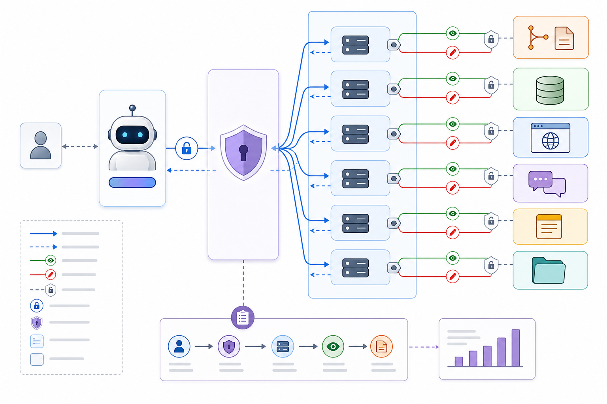

# 083. MCP 개념

난이도: 고급  
기준일: 2026년 05월 03일
저자: AI_Innovation_Studio



## 핵심 개념

MCP(Model Context Protocol)는 Claude Code가 외부 도구, 데이터베이스, API, 문서 저장소와 연결되는 표준 프로토콜입니다. MCP 서버는 Claude에게 tools, resources, prompts를 노출하고, Claude Code는 이를 통해 GitHub, DB, 브라우저, Slack, Notion 같은 외부 시스템을 다룰 수 있습니다.

MCP를 이해할 때 중요한 점은 “Claude에게 더 많은 권한을 주는 기술”이라는 점입니다. 편리함보다 권한 설계가 먼저입니다.

## MCP가 제공하는 것

| 요소 | 의미 | 예시 |
| --- | --- | --- |
| Tools | Claude가 호출할 수 있는 동작 | issue 생성, DB query, browser click |
| Resources | Claude가 읽을 수 있는 자료 | 파일, 문서, 스키마, 로그 |
| Prompts | 서버가 제공하는 재사용 프롬프트 | PR 리뷰, 이슈 triage |

## Claude Code에서 추가하는 예

```text
claude mcp add --transport http sentry https://mcp.sentry.dev/mcp
```

연결 후 Claude Code 안에서 상태를 확인합니다.

```text
/mcp
```

OAuth가 필요한 서버는 `/mcp` 메뉴에서 브라우저 인증을 진행할 수 있습니다.

## 좋은 도입 순서

1. 읽기 전용 MCP부터 연결한다.
2. 어떤 tools/resources가 노출되는지 확인한다.
3. 권한 범위를 최소화한다.
4. 테스트 저장소나 샌드박스에서 검증한다.
5. 쓰기 작업은 승인 절차를 둔다.

## MCP 도입 원칙

MCP는 기능 추가가 아니라 권한 추가로 보아야 합니다. 연결할 때는 다음 세 가지를 먼저 정합니다.

- 접근 가능한 데이터의 범위
- Claude가 호출할 수 있는 동작의 범위
- 사고가 났을 때 연결을 끊고 추적하는 절차

팀 환경에서는 개인 편의를 위해 연결한 MCP가 조직 데이터 전체에 접근하지 않도록 해야 합니다. 특히 GitHub, Jira, Slack, Database처럼 업무 기록과 권한이 섞인 도구는 읽기 전용 검토부터 시작하세요.

## 허용과 차단 예시

| 구분 | 예시 |
| --- | --- |
| 우선 허용 | 공개 문서 읽기, 테스트 저장소 issue 조회, 로컬 docs 폴더 검색 |
| 승인 후 허용 | PR 코멘트 게시, Jira 댓글 작성, Notion 문서 수정 |
| 기본 차단 | 운영 DB 쓰기, 결제/발송/삭제, 조직 전체 Slack 검색 |

## MCP 요청 예시

```text
연결된 MCP 서버 목록과 각 서버가 노출하는 도구를 요약해줘.

확인할 것:
1. 서버 이름
2. transport
3. 인증 필요 여부
4. 읽기/쓰기 가능성
5. 위험한 도구
6. 권장 사용 범위
```

## MCP를 도입하기 전 질문

MCP는 “연결할 수 있다”보다 “연결해도 되는가”가 먼저입니다.

| 질문 | 이유 |
| --- | --- |
| 이 도구가 꼭 Claude Code 안에 있어야 하는가? | 불필요한 권한 확장을 막기 위해 |
| 읽기만 필요한가, 쓰기도 필요한가? | 최소 권한 설계를 위해 |
| 어떤 데이터가 반환되는가? | 민감 정보 노출을 막기 위해 |
| 누가 토큰을 관리하는가? | 퇴사/권한 변경 대응을 위해 |
| 로그는 어디에 남는가? | 감사와 사고 대응을 위해 |

## MCP와 일반 CLI의 차이

일반 CLI는 사용자가 명령을 직접 입력합니다. MCP는 Claude가 도구 설명을 보고 적절한 tool을 호출할 수 있습니다. 따라서 MCP tool description은 사실상 권한 설명서입니다. 설명이 모호하면 Claude가 잘못된 상황에서 도구를 쓸 수 있습니다.

## 실습 프롬프트

```text
내 프로젝트에 MCP를 도입할 후보를 정리해줘.

후보:
- GitHub
- Database
- Browser
- Notion/Jira/Slack
- Filesystem

각 후보에 대해:
1. 필요한 이유
2. 읽기/쓰기 권한
3. 접근 가능한 데이터
4. 민감 정보 위험
5. 먼저 샌드박스에서 검증할 방법
6. 도입 우선순위
```

## 체크리스트

- [ ] MCP는 외부 시스템 권한을 확장한다는 점을 이해한다.
- [ ] `/mcp`로 연결 상태와 인증을 확인한다.
- [ ] 읽기 전용부터 시작한다.
- [ ] 쓰기 도구는 승인 절차를 둔다.
- [ ] 팀 저장소에 설정을 공유하기 전 보안 검토를 한다.
- [ ] 연결 해제와 권한 회수 절차를 확인한다.
- [ ] MCP 도입 이유가 단순 편의인지 운영상 필요한지 구분한다.

## 다음 단계

다음 장에서는 stdio와 HTTP transport의 차이를 다룹니다.
