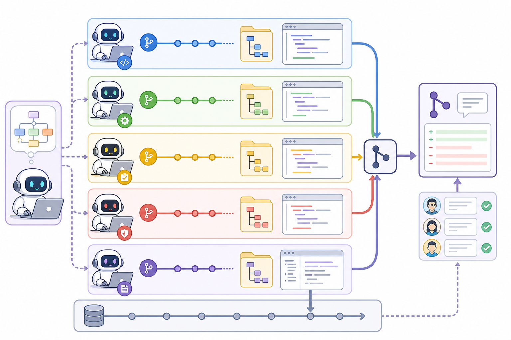

# 098. Agent Teams와 병렬 작업

난이도: 고급  
기준일: 2026년 05월 03일



## 핵심 개념

Agent Teams는 여러 전문 에이전트를 병렬로 활용하는 작업 방식입니다. 병렬화의 핵심은 많은 에이전트를 쓰는 것이 아니라 서로 충돌하지 않는 독립 작업으로 나누는 것입니다.

## 병렬화하기 좋은 작업

- 코드 리뷰와 테스트 공백 분석
- 프론트엔드와 백엔드가 명확히 분리된 기능
- 문서 초안과 구현 작업
- 여러 독립 버그 조사
- 보안 리뷰와 성능 리뷰

## 병렬화하면 안 좋은 작업

- 같은 파일을 여러 에이전트가 수정
- 요구사항이 아직 모호한 작업
- DB migration처럼 순서가 중요한 작업
- 인증/권한처럼 단일 설계 판단이 필요한 작업

## 작업 분해 템플릿

```text
이 작업을 병렬 가능한 하위 작업으로 나눠줘.

각 하위 작업에 포함:
1. 목표
2. 담당 에이전트
3. 읽을 파일
4. 수정 가능한 파일
5. 수정 금지 파일
6. 산출물
7. 병합 시 확인할 충돌 위험
```

## 예시

```text
프론트엔드: 프로필 수정 UI
백엔드: 프로필 수정 API
테스트: API와 UI 테스트 케이스
문서: README/PR 설명
보안: 권한과 입력 검증 리뷰
```

각 작업의 write set이 겹치지 않아야 합니다.

## 병렬 작업 운영 흐름

1. 요구사항과 수용 기준을 먼저 합의한다.
2. 공유 계약(API, schema, event name)을 정한다.
3. 작업을 write set 기준으로 나눈다.
4. 각 에이전트에게 수정 가능 파일과 금지 파일을 지정한다.
5. 중간 결과는 변경 파일, 테스트, 위험 중심으로 받는다.
6. 통합 담당자가 충돌과 계약 불일치를 확인한다.
7. 통합 테스트와 리뷰를 한 번 더 실행한다.

## 통합 담당자의 역할

Agent Teams에서 가장 중요한 역할은 모든 결과를 합치는 사람입니다. 통합 담당자는 다음을 확인합니다.

- 각 에이전트가 범위를 지켰는가
- API와 타입 계약이 일치하는가
- 같은 설정 파일을 서로 다르게 바꾸지 않았는가
- 테스트가 한쪽 worktree에서만 통과한 것은 아닌가
- 문서와 실제 동작이 일치하는가

## 병렬화 판단 질문

```text
이 작업이 병렬화에 적합한지 판단해줘.

확인할 것:
1. 독립 가능한 하위 작업
2. 공유 계약
3. 파일 충돌 가능성
4. 먼저 확정해야 할 설계 결정
5. 병렬화하지 말아야 할 부분
6. 통합 검증 계획
```

## 체크리스트

- [ ] 하위 작업이 독립적이다.
- [ ] 각 에이전트의 수정 파일 범위가 다르다.
- [ ] 공유 계약(API/schema)은 먼저 합의한다.
- [ ] 병합 순서와 검증 계획이 있다.
- [ ] 결과 통합 담당이 명확하다.

## 다음 단계

다음 장에서는 Git worktree를 사용해 병렬 작업 충돌을 줄이는 방법을 다룹니다.
