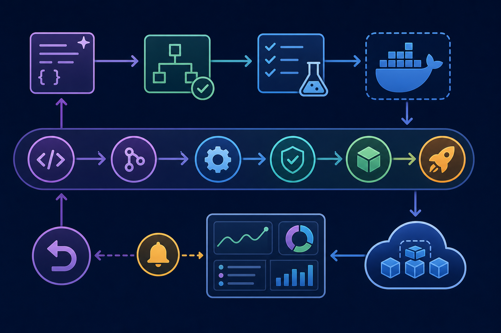

# 100. Claude Code 프로덕션 운영 전략

난이도: 고급  
기준일: 2026년 05월 03일
저자: AI_Innovation_Studio



## 핵심 개념

Claude Code를 프로덕션 수준으로 쓰려면 개인 생산성 도구가 아니라 운영 가능한 개발 시스템으로 설계해야 합니다. 핵심은 권한, 검증, 기록, 리뷰, 배포, 모니터링입니다.

## 운영 원칙

1. `CLAUDE.md`로 프로젝트 규칙을 명문화한다.
2. 민감 파일과 위험 명령을 설정/Hook으로 차단한다.
3. 코드 변경은 테스트와 리뷰를 거친다.
4. MCP는 최소 권한으로 연결한다.
5. Subagent는 역할별로 도구 권한을 제한한다.
6. GitHub Actions 같은 자동화는 secret과 권한을 검토한다.
7. 프로덕션 배포는 AI가 단독 실행하지 않는다.

## 팀 도입 단계

| 단계 | 목표 |
| --- | --- |
| 1 | 개인 사용, 읽기 전용 분석 |
| 2 | 작은 코드 수정과 테스트 |
| 3 | 팀 `CLAUDE.md`, PR 템플릿, 리뷰 기준 |
| 4 | Skills/Hooks/MCP 도입 |
| 5 | GitHub Actions/SDK 기반 자동화 |
| 6 | 운영 지표와 감사 로그 관리 |

## 운영 책임

프로덕션 운영에서는 기능별 소유자를 정해야 합니다.

| 영역 | 책임 |
| --- | --- |
| 프로젝트 지침 | `CLAUDE.md`와 PR 기준 유지 |
| 권한 | MCP, filesystem, subagent 도구 권한 관리 |
| 자동화 | Hooks, Skills, CI 작업 검토 |
| 검증 | 테스트 명령, 평가셋, 릴리스 기준 관리 |
| 사고 대응 | 토큰 회수, 롤백, 감사 로그 확인 |

소유자가 없으면 자동화가 쌓인 뒤 누구도 끄지 못하는 상태가 됩니다. 작게 시작하더라도 권한을 승인하고 회수할 사람은 먼저 정하세요.

## 프로덕션 체크리스트

```text
Claude Code 운영 준비를 점검해줘.

확인할 것:
1. CLAUDE.md 품질
2. 민감 파일 차단
3. 테스트 명령 문서화
4. PR 리뷰 기준
5. MCP 권한
6. Hooks 보안
7. Subagent 권한
8. GitHub Actions secret
9. 배포 승인 절차
10. 모니터링과 롤백 계획
```

## 금지할 자동화

- 운영 DB 직접 수정
- secret 출력
- 승인 없는 배포
- destructive 명령 자동 실행
- 대량 권한 부여
- 테스트 삭제로 CI 통과

## 릴리스 게이트

AI가 만든 변경도 일반 변경과 같은 릴리스 게이트를 통과해야 합니다.

1. 변경 파일과 목적을 요약한다.
2. 관련 테스트와 리뷰를 통과한다.
3. 민감 정보와 권한 변경을 확인한다.
4. 배포 승인자를 분리한다.
5. 롤백 또는 feature flag 계획을 확인한다.
6. 배포 후 모니터링 지표를 본다.

## 운영 체계

Claude Code를 팀 운영에 넣을 때는 다음 계층으로 나누어 관리합니다.

| 계층 | 관리 대상 |
| --- | --- |
| 지침 | `CLAUDE.md`, PR 템플릿, 리뷰 기준 |
| 권한 | MCP scope, filesystem 범위, tool 권한 |
| 자동화 | Skills, Hooks, CI/CD |
| 검증 | 테스트, lint, 보안 리뷰, 평가셋 |
| 기록 | 변경 요약, 명령 로그, PR, audit log |
| 복구 | rollback, token revoke, incident runbook |

## 사고 대응 관점

AI 기반 자동화도 일반 운영 시스템처럼 실패를 가정해야 합니다.

```text
Claude Code 관련 사고 대응 runbook을 작성해줘.

상황:
- 잘못된 파일 수정
- secret 출력 가능성
- MCP 권한 과다 부여
- 승인 없는 외부 코멘트 작성

포함:
1. 즉시 중단할 명령/연결
2. 영향 범위 확인
3. 되돌릴 방법
4. 토큰 회수
5. 재발 방지 설정
```

## 성숙도 모델

| 단계 | 상태 |
| --- | --- |
| 1 | 개인이 수동으로 Claude Code 사용 |
| 2 | 팀 공통 지침과 테스트 기준 존재 |
| 3 | 반복 작업을 Skills로 표준화 |
| 4 | 제한된 Hooks와 MCP를 운영 |
| 5 | 감사 로그, 권한 회수, 사고 대응까지 문서화 |

## 체크리스트

- [ ] AI 작업 결과도 일반 코드와 같은 리뷰를 거친다.
- [ ] 권한은 최소화되어 있다.
- [ ] 자동화는 로그와 감사 가능성을 가진다.
- [ ] 배포와 DB 변경은 별도 승인 절차가 있다.
- [ ] 사고 시 되돌릴 방법이 있다.
- [ ] 권한과 자동화의 운영 소유자가 정해져 있다.
- [ ] 릴리스 전 검증과 롤백 기준이 문서화되어 있다.

## 다음 단계

본문 100선을 마쳤습니다. 부록에서는 명령어, 템플릿, 체크리스트를 바로 쓸 수 있는 형태로 정리합니다.
