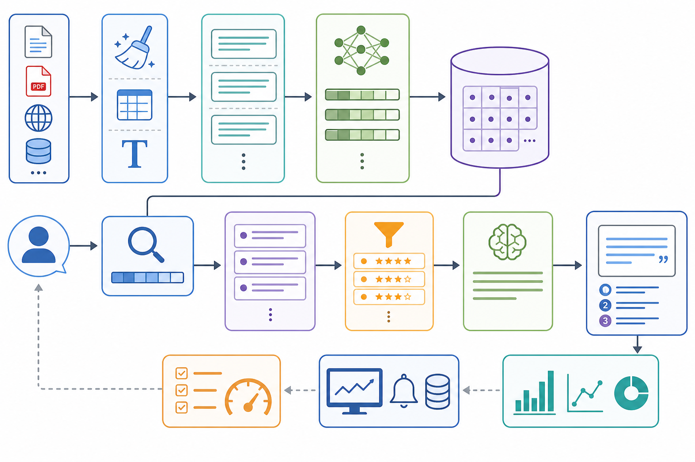

# 112. RAG 설계 체크리스트

저자: AI_Innovation_Studio



RAG는 문서를 검색해 답변에 활용하는 구조입니다. 좋은 RAG는 모델보다 먼저 문서 품질, 청킹, 검색, 인용, 평가 설계가 안정되어야 합니다.

## 핵심 흐름

```text
문서 수집 -> 정제 -> 청킹 -> 임베딩 -> 벡터 저장 -> 검색 -> 재랭킹 -> 생성 -> 인용 -> 평가
```

## 설계 체크리스트

- [ ] 문서 출처와 최신성이 명확하다.
- [ ] 중복 문서와 오래된 문서를 제거한다.
- [ ] 청킹 기준이 문서 구조와 맞다.
- [ ] 검색 결과에 원문 출처를 함께 보관한다.
- [ ] 답변에 출처를 표시한다.
- [ ] 모르는 질문에 억지로 답하지 않는다.
- [ ] 평가셋으로 검색 품질과 답변 품질을 따로 측정한다.

## 청킹 기준

청킹은 단순히 글자 수로 자르는 작업이 아닙니다. 문서의 의미 단위가 끊기면 검색 결과는 맞아도 답변 품질이 떨어집니다.

| 문서 유형 | 권장 기준 |
| --- | --- |
| 매뉴얼 | 제목, 소제목, 절차 단위 |
| API 문서 | 엔드포인트와 요청/응답 예시 단위 |
| 회의록 | 안건, 결정, 후속 작업 단위 |
| 정책 문서 | 조항, 예외, 적용 범위 단위 |
| FAQ | 질문과 답변 한 쌍 |

청크에는 원문 경로, 제목, 섹션, 작성일, 갱신일 같은 메타데이터를 함께 저장하세요. 나중에 출처 표시와 오래된 문서 제거에 필요합니다.

## 문서 갱신 정책

RAG 품질은 문서 갱신 정책에 크게 좌우됩니다.

| 항목 | 기준 |
| --- | --- |
| 수집 주기 | 문서 변경 빈도에 맞춰 결정 |
| 삭제 문서 | 검색 대상에서 제거하거나 낮은 우선순위 처리 |
| 중복 문서 | canonical 문서를 정하고 나머지는 제외 |
| 권한 | 사용자가 볼 수 있는 문서만 검색 |
| 출처 | 답변에서 원문 위치를 확인 가능하게 저장 |

특히 권한이 섞인 사내 문서에서는 “검색되면 안 되는 문서”를 먼저 정의해야 합니다.

## 검색 품질 평가

RAG 평가는 최종 답변만 보면 원인을 찾기 어렵습니다. 먼저 검색 단계만 따로 평가해야 합니다.

- 사용자의 질문에 맞는 문서가 상위 결과에 있는가?
- 오래된 문서가 최신 문서보다 위에 나오지 않는가?
- 같은 내용의 중복 문서가 결과를 차지하지 않는가?
- 검색 결과 없이 답해야 하는 질문을 구분하는가?
- 출처를 사용자가 확인할 수 있게 남기는가?

## 실패 패턴

| 실패 | 원인 |
| --- | --- |
| 관련 없는 문서 검색 | 청킹, 임베딩, 질의 변환 문제 |
| 답변은 자연스럽지만 틀림 | 생성 단계에서 근거를 벗어남 |
| 최신 정보 누락 | 문서 동기화 주기 문제 |
| 출처가 불명확함 | 메타데이터 저장 누락 |
| 비용 증가 | 너무 많은 문서와 긴 컨텍스트 |

## Claude에게 줄 요청

```text
다음 문서 기반 Q&A 기능을 RAG로 설계해줘.

문서 종류:
사용자 질문 예시:
정확성이 중요한 이유:
업데이트 주기:

출력:
1. 수집과 정제 계획
2. 청킹 기준
3. 검색과 재랭킹 전략
4. 답변과 출처 표시 방식
5. 평가셋 초안
6. 운영 중 모니터링 지표
```

## 완료 기준

- [ ] 검색 결과만 따로 평가했다.
- [ ] 최종 답변 품질을 따로 평가했다.
- [ ] 출처 없는 답변을 제한했다.
- [ ] 문서 업데이트 절차를 정했다.
- [ ] 오래된 문서를 비활성화하거나 낮은 우선순위로 보낼 기준이 있다.
- [ ] 검색 실패 사례를 평가셋에 다시 넣는 절차가 있다.
- [ ] 권한상 검색되면 안 되는 문서를 제외했다.
